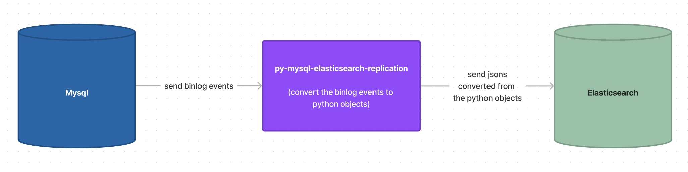

## Description

</img>

This project replicates Mysql to Elasticsearch, which is being developed but able to migrate data between the two databases in a simple way.

Note that the project does not supoort HTTPS when migrating.

The project is a modified version of [py-mysql-elasticsearch-sync](https://github.com/zhongbiaodev/py-mysql-elasticsearch-sync), using library named [python-mysql-replication](https://github.com/julien-duponchelle/python-mysql-replication).


<br>

## Give it a try!

make containers by:

```
docker-compose up
```


<br>

stop the elasticsearch container and modify /usr/share/elasticsearch/config/elasticsearch.yml as:

```
(edit true to false) xpack.security.enabled: false

(at the end of the file add this) action.destructive_requires_name: false
```


<br>

restart the elasticsearch container, and in the pymyelarepl container,

```
(for test) cd pymyelarepl && python test/test.py

(after executing some sql in the mysql container, for example) cd pymyelarepl && python example/run.py
```


<br>

the results of the two cases are like the below:

```
{'errors': False, 'took': 12, 'items': [{'create': {'_index': 'basic_replication', '_id': '1', '_version': 1, 'result': 'created', '_shards': {'total': 2, 'successful': 1, 'failed': 0}, '_seq_no': 6, '_primary_term': 1, 'status': 201}}, {'create': {'_index': 'basic_replication', '_id': '2', '_version': 1, 'result': 'created', '_shards': {'total': 2, 'successful': 1, 'failed': 0}, '_seq_no': 7, '_primary_term': 1, 'status': 201}}]}
{'errors': False, 'took': 11, 'items': [{'update': {'_index': 'basic_replication', '_id': '1', '_version': 2, 'result': 'updated', '_shards': {'total': 2, 'successful': 1, 'failed': 0}, '_seq_no': 8, '_primary_term': 1, 'status': 200}}, {'update': {'_index': 'basic_replication', '_id': '2', '_version': 2, 'result': 'updated', '_shards': {'total': 2, 'successful': 1, 'failed': 0}, '_seq_no': 9, '_primary_term': 1, 'status': 200}}]}
{'errors': False, 'took': 2, 'items': [{'delete': {'_index': 'basic_replication', '_id': '1', '_version': 3, 'result': 'deleted', '_shards': {'total': 2, 'successful': 1, 'failed': 0}, '_seq_no': 10, '_primary_term': 1, 'status': 200}}, {'delete': {'_index': 'basic_replication', '_id': '2', '_version': 3, 'result': 'deleted', '_shards': {'total': 2, 'successful': 1, 'failed': 0}, '_seq_no': 11, '_primary_term': 1, 'status': 200}}]}
```


<br>

## License

MIT